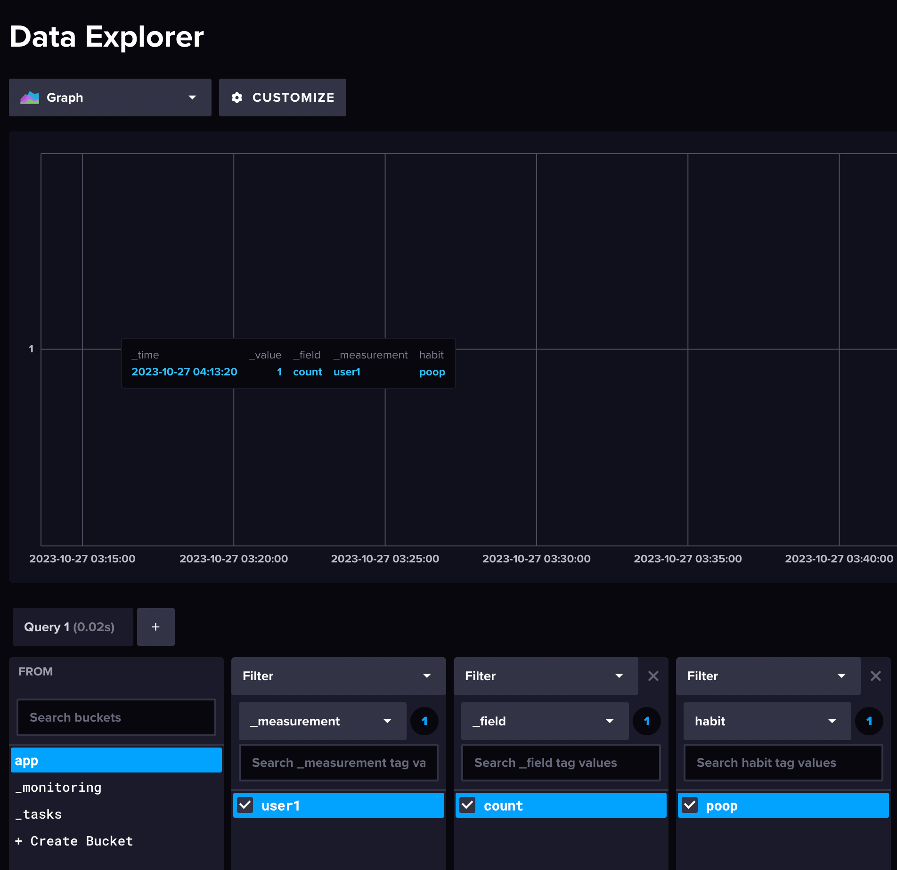

## HabitPulse. Part 2

- [Part1](habitpulse-part1)
- [Part3](habitpulse-part3) (coming soon)

### Introduction

Before we dive into coding our habit-tracking Telegram bot, it's crucial to set up our workspace with all the necessary tools. This means installing and configuring each component so that everything is ready and tested. This way, we can get straight to development, confident that our tools are in place and functioning. In this article, we'll guide you through preparing your environment with Telegram, InfluxDB, and Go — the key ingredients for our project.

### 1. Setting Up the Telegram Bot

The first step in creating our habit-tracking application is to establish a Telegram bot, which will serve as the interface between the user and the application. Here’s how you can set up your bot:

- Go to the Telegram App and search for @BotFather.
- Create a new bot by sending the `/newbot` command.
- Name your bot something like `habitpulsebot`.
- Once created, BotFather will provide you a token. Note it down as it will be used to authenticate requests to the Telegram API.
  

### 2. Create a Repository

After setting up the bot, we need a place to store and manage our code. Here's what to do:

Go to GitHub and create a new repository called `habitpulse`.
This repository will help us keep track of changes and collaborate on our code.
With the repository ready, we can start coding with everything organized from the start.

### 3. Setting Up InfluxDB on macOS

Having a local database is crucial for experimenting, debugging, and monitoring our application's behavior during development. For macOS users, setting up InfluxDB is straightforward:

Open your terminal and use Homebrew to install InfluxDB with the command: brew install influxdb.
After the installation, start the InfluxDB service by running brew services start influxdb.
You can then access the InfluxDB interface by visiting http://localhost:8086 on your browser, where you can configure your organization, user, and bucket, and retrieve your token for API access.


For those on other systems, I'll provide (here's a link)[https://docs.influxdata.com/influxdb/v2/install/] to the official InfluxDB installation guide for different platforms.

With InfluxDB set up locally, you have a powerful tool at your disposal to ensure that your data management is robust and easily accessible, allowing you to focus on building and improving your habit-tracking bot.

### 4. Setting Up Your Go Environment

I suggest using Go 1.21 or higher for this project. If you don't have Go installed, you can follow the (official installation guide for your platform)[https://go.dev/doc/install].

Create a folder and initialize your Go module and get the required packages:

```bash
go mod init github.com/yourusername/habitpulse
go get -u github.com/go-telegram-bot-api/telegram-bot-api/v5
go get github.com/influxdata/influxdb-client-go/v2
go mod tidy
```

### 5. Sample Code

Here's a basic Go program to get you started:

```go
package main

import (
	"context"
	"log"
	"time"

	tgbotapi "github.com/go-telegram-bot-api/telegram-bot-api/v5"
	influxdb2 "github.com/influxdata/influxdb-client-go/v2"
)

func main() {
	// Setting up the Telegram bot
	botToken := "YOUR_TELEGRAM_BOT_TOKEN"
	bot, err := tgbotapi.NewBotAPI(botToken)
	if err != nil {
		log.Panic(err)
	}

	u := tgbotapi.NewUpdate(0)
	u.Timeout = 60

	updates := bot.GetUpdatesChan(u)

	influxURL := "http://localhost:8086"
	client := influxdb2.NewClient(influxURL, "YOUR_INFLUXDB_TOKEN")
	defer client.Close()
	writeAPI := client.WriteAPIBlocking("YOUR_ORG", "YOUR_BUCKET")
	// Create point using full params constructor
	p := influxdb2.NewPoint("user1",
		map[string]string{"habit": "poop"},
		map[string]interface{}{"count": 1},
		time.Now())

	// write point immediately
	err = writeAPI.WritePoint(context.Background(), p)
	if err != nil {
		log.Fatal(err)
	}

	// Just to ensure connection
	log.Printf("Successfully connected to InfluxDB at %s", influxURL)

	for update := range updates {
		if update.Message == nil {
			continue
		}
		msg := tgbotapi.NewMessage(update.Message.Chat.ID, "Hello, World!")
		bot.Send(msg)
	}
}

```

Replace YOUR_TELEGRAM_BOT_TOKEN , YOUR_INFLUXDB_TOKEN, YOUR_ORG, YOUR_BUCKET with appropriate values.

> Important: For security reasons, never store sensitive information like tokens directly in your source code. In a real-world application, you'd ideally fetch these values from environment variables, a secrets manager, or an external configuration. For this demonstration and initial setup, we're using hardcoded values, but remember that these tokens can be regenerated if exposed.

6. Verify Bot and Data in InfluxDB

Simply run the program:

```shell
go run main.go
```

Open Telegram and send a message to your bot. You should receive a response back.

After running your program and recording a sample point, access InfluxDB's web interface. Navigate to your metric to confirm the data has been successfully written.


Congratulations! You've set up a basic Telegram bot with Go and InfluxDB for habit tracking.

### Next Steps

Since we've set up our development environment, we're ready to start building our habit-tracking bot. In the next article, we'll focus on defining the MVP and constructing the main workflow for our Telegram bot.
