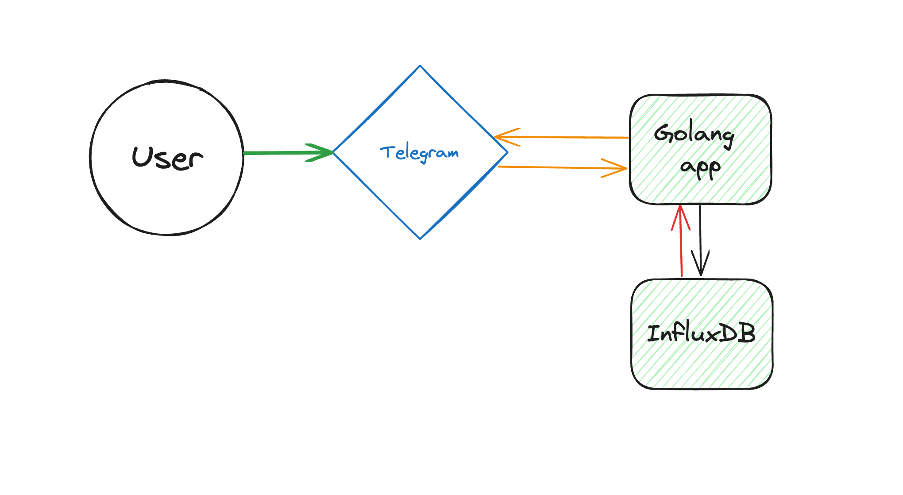

## Building a Habit-Tracking Telegram Bot with Golang and InfluxDB

### Motivation

Each of us strives to cultivate good habits, whether it's exercising regularly, reading daily, or practicing a hobby. However, tracking these activities can sometimes be cumbersome. While numerous fitness and tracking apps exist, they often come overloaded with features, making simple tasks seem complicated. This motivated me to develop a straightforward Telegram bot focused purely on habit tracking, leveraging the power of Golang and InfluxDB.

### High-Level Design

The bot's primary function is to let users log their daily activities. Users can create their own habit categories (like push-ups, pages read, etc.) and log numerical values under them. These values are then stored and can be visualized in the form of graphs, providing a clear picture of one's progress.

### Technical Decisions

### Why Golang?

Golang (or Go) was chosen for several reasons:

- **Familiarity**: I am well-versed with Go, making development smoother.
- **Efficiency**: Go is fast and compiles to binary, which means deployment is hassle-free.
- **Low Resource Consumption**: The bot, when deployed, uses minimal system resources.
- **Rich Libraries**: Go boasts a plethora of libraries, making it apt for various functionalities, including generating graphs for our use-case.

### Why InfluxDB?

InfluxDB, a Time Series Database (TSDB), suits our needs perfectly because:

- **Metrics Over Time**: As our bot tracks habits over time, using a TSDB makes sense.
- **Built-in Statistical Functions**: These help in generating insights from the tracked data.
- **PUSH Model**: InfluxDB works well with a PUSH model, which aligns with our bot's data input mechanism.
- **System Metrics**: Apart from user habit data, we can also track application-specific metrics, helping in monitoring the bot's performance.

### Data Structure in TSDB

Each user corresponds to a metric in the database, and the habits they track are labels. This provides a flat and interconnected data structure. It ensures efficient data retrieval and updates.

### Interactions

1. User interaction with the Telegram Bot.
2. Bot sending/retrieving data to/from the Go service.
3. Go service interacting with InfluxDB to store/retrieve data.

### Conclusion

Building a habit-tracking Telegram bot with Golang and InfluxDB is both educational and practical. It simplifies habit tracking and serves as a testament to the capabilities of Golang and InfluxDB in building efficient and functional applications.
